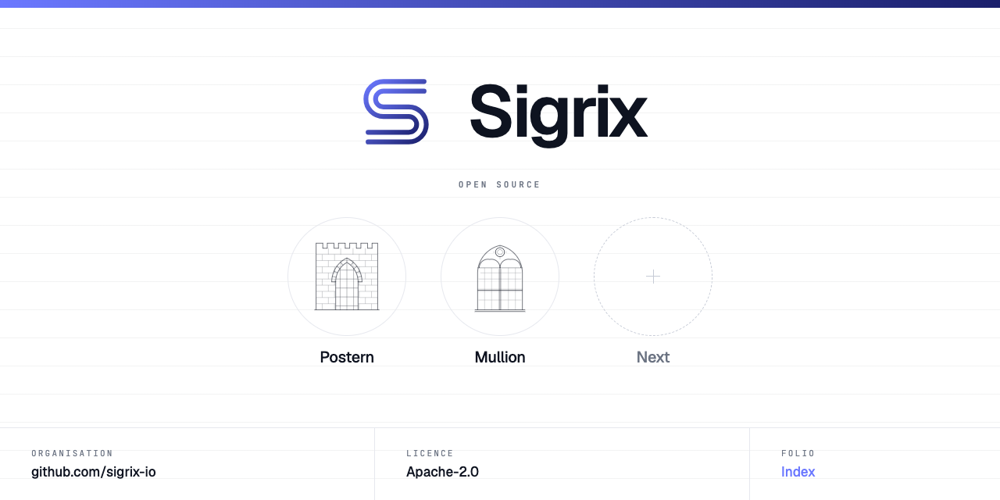
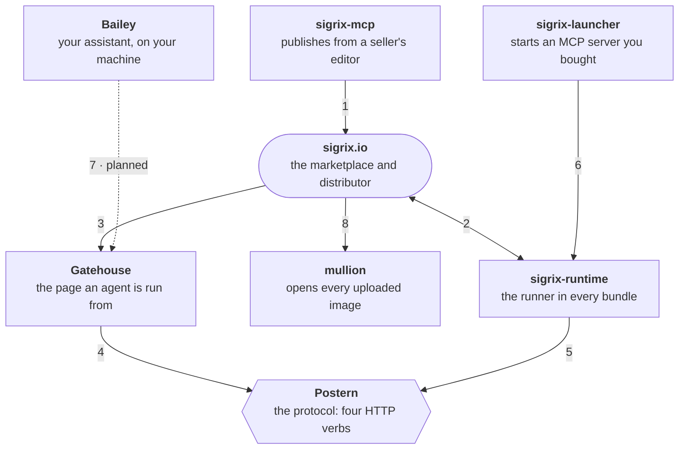

  

## The marketplace for vetted AI tools

**Buy an AI agent, prompt, skill, persona or assistant once — then run it in the AI tools you already use.**

Independent creators publish prompts, personas, skills, assistants and agents. We test every listing before it goes live — so the person at the keyboard spends time using AI, not debugging it.

**[Browse the marketplace →](https://sigrix.io/marketplace)**  ·  [Publish a listing](https://sigrix.io/publish)  ·  [Sell on Sigrix](https://sigrix.io/sell)

---

### Open source at Sigrix

The parts of Sigrix that other people build against, we publish, under Apache-2.0. The protocol an agent is run and licensed under is drafted in the open, and so is everything that speaks it: the runner inside every bundle a buyer downloads, the page an agent is run from, the client a seller publishes through and the launcher a buyer's client starts. Bailey, the assistant the solutions sold on Sigrix are built for, is open from its first release, and the library that opens every image uploaded to Sigrix is a package anyone who takes uploads can use.

| Project | What it is | Start with |
| --- | --- | --- |
| **[Bailey](https://github.com/sigrix-io/bailey)** | An open-source AI assistant that runs ready-made solutions on your own machine, with your own AI key. | `uvx bailey doctor`, which checks that a machine has what the assistant will need |
| **[Postern](https://github.com/sigrix-io/postern)** | The open execution and entitlement protocol for packaged AI agents: four HTTP verbs an agent serves, and the licence check the packaging standards leave out. | [The specification](https://github.com/sigrix-io/postern/blob/main/SPEC.md), then `pip install postern-conformance` to check a runner against it |
| **[Gatehouse](https://github.com/sigrix-io/gatehouse)** | A browser client for Postern: the page a person runs an agent from, for any runner that serves the four verbs. | `npm install @sigrix-io/gatehouse`, or serve its five files from `src/` as they are |
| **[sigrix-mcp](https://github.com/sigrix-io/sigrix-mcp)** | Publish a prompt, persona or skill to Sigrix from the AI client you already write in. | `uvx sigrix-mcp`, with a seller token from your Sigrix account |
| **[sigrix-launcher](https://github.com/sigrix-io/sigrix-launcher)** | Start an MCP server you bought on Sigrix from the client you already use. | `uvx sigrix-launcher run <seller>/<listing-id>`, the line a listing's page hands your client |
| **[sigrix-runtime](https://github.com/sigrix-io/sigrix-runtime)** | The Postern runner inside every bundle Sigrix delivers: the four verbs and the licence check, on the buyer's own machine. | `pip install sigrix-runtime`; every Sigrix bundle already carries it |
| **[mullion](https://github.com/sigrix-io/mullion)** | One correct way to open an image: EXIF orientation applied, transparency resolved rather than dropped. | `pip install mullion` |

Copy the package names rather than guessing them: `postern` on PyPI and `gatehouse` on npm belong to unrelated projects.

#### How the pieces connect

A seller publishes to Sigrix, Sigrix delivers a bundle, and the page and the runner meet over Postern's four verbs, on the buyer's own machine.

1. **sigrix-mcp → sigrix.io.** A seller publishes a draft from their editor through the seller API, into the review queue.
2. **sigrix.io ↔ sigrix-runtime.** Every bundle Sigrix delivers carries the runner, and the runner asks Sigrix whether the buyer still owns the listing before it runs anything.
3. **sigrix.io → Gatehouse.** Sigrix draws its run page and its previews with Gatehouse.
4. **Gatehouse → Postern.** Gatehouse calls a runner's four verbs over fetch, from the browser.
5. **sigrix-runtime → Postern.** sigrix-runtime serves the four verbs as the specification's complete implementation, the entitlement check included.
6. **sigrix-launcher → sigrix-runtime.** The launcher checks the purchase and downloads the seller's package with the runtime's own client code.
7. **Bailey → Gatehouse, planned.** Once the assistant itself ships, Bailey draws a solution's apps with Gatehouse.
8. **sigrix.io → mullion.** Every image uploaded to Sigrix is opened, fitted and encoded by mullion.

**[Every project, and what it ships →](https://sigrix.io/open-source)**  ·  [Postern's project page](https://sigrix.io/open-source/postern)  ·  [Read the specification](https://github.com/sigrix-io/postern/blob/main/SPEC.md)

---

### Five building blocks, from one-line prompt to autonomous agent

A taxonomy that follows complexity. Pick the smallest unit that solves your problem — most people need a prompt, not an agent.

| | |
| --- | --- |
| **[Prompts](https://sigrix.io/marketplace/prompts)** | Single-instruction templates that produce a specific output: a draft, an analysis, a reformat. Drop in, fill the variables, run. |
| **[Personas](https://sigrix.io/marketplace/personas)** | System prompts that give a model a stable role, tone and worldview — so a generic chat surface acts like a senior editor or a tax advisor. |
| **[Skills](https://sigrix.io/marketplace/skills)** | Composable mini-capabilities you bolt onto an existing assistant — a calculator, a citation checker, a tone enforcer. |
| **[Assistants](https://sigrix.io/marketplace/assistants)** | Persona + skills + memory, packaged as a working tool with a defined surface area. Hire one for a job; it stays in scope. |
| **[Agents](https://sigrix.io/marketplace/agents)** | Multi-step systems that plan, call tools and keep going until a goal is met. The most powerful tier — and the one that needs the most scrutiny. |

[How the building blocks fit together →](https://sigrix.io/ai-building-blocks)

### Every listing is tested before it goes live

1. **Creator submits** — with the prompt, the model it was built for, and what it costs to run.
2. **Editorial review** — is it clear, honest, and described the way a buyer would search for it?
3. **Functional test** — we run it. It has to do what the listing says.
4. **Safety + IP check** — no unsafe output, no borrowed work.
5. **Goes live** — published with its verdict visible on the listing.

### What we stand for

- **Verified quality.** Every listing tested before publication.
- **Honest education.** We teach the limits, not just the wins.
- **Creator upside.** Independent makers keep credit and a reduced commission.
- **Fit-based discovery.** Ranking matches the buyer, not the bidder.
- **Transparent surfaces.** Show the prompt, the model, the token cost.

> AI can only go as far as the people using it understand and guide it. Sigrix exists to close that gap — verified components, plain-English documentation, and discovery that matches the buyer instead of the highest bidder.

[Read more about us →](https://sigrix.io/about)  ·  [Meet the team](https://sigrix.io/about/team)  ·  [Learn](https://sigrix.io/learn)  ·  [FAQ](https://sigrix.io/faq)

---

### About this organisation

Sigrix is a commercial marketplace, and the platform that runs it is closed-source, so you won't find its application code here. What you will find is everything under *Open source at Sigrix* above, each project in its own repository with its own issues and contribution notes, and the public policies that cover the organisation.

- **Building on one of the projects** — issues and pull requests go to that project's own repository; read its `CONTRIBUTING.md` first.
- **Security researchers** — please read our [security policy](https://github.com/sigrix-io/.github/blob/main/SECURITY.md) before testing, and report privately.
- **Buyers and sellers** — product questions, bugs and feature requests belong in the [Sigrix hub](https://sigrix.io/hub), not in GitHub issues.
- **Anything else** — <support@sigrix.io>.

[sigrix.io](https://sigrix.io) · [LinkedIn](https://www.linkedin.com/company/sigrix) · [Terms](https://sigrix.io/legal/terms-and-conditions) · [Privacy](https://sigrix.io/legal/privacy-policy)
